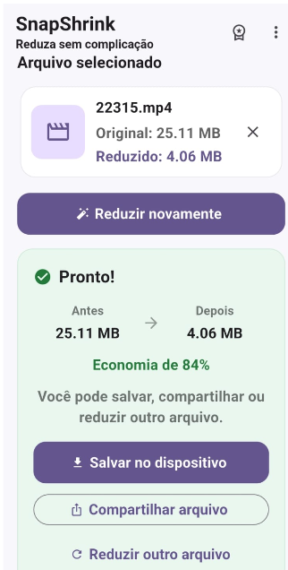
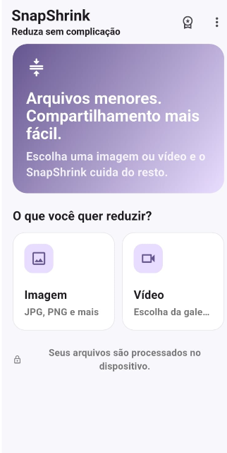

# \# SnapShrink

# 

# \### Smart Video \& Image Compression for Android

# 

# 

# &#x20; 

# &#x20; 

# &#x20; 

# &#x20; 

# &#x20; 

# 

# 

# SnapShrink is an Android application built with Flutter for fast and efficient video and image compression.

# 

# \## 📱 App Preview

# 

# 

# &#x20; 

# &#x20; 

# &#x20; 

# &#x20; 

# &#x20; 

# 

# 

# \## 🚀 Features

# 

# \- Video compression

# \- Image compression

# \- File size optimization

# \- Fast file sharing

# \- Monthly Premium subscription

# \- Annual Premium subscription

# \- Google Play Billing 8

# \- Google Mobile Ads

# \- Android SDK 36

# 

# \## 🛠 Tech Stack

# 

# \- Flutter

# \- Dart

# \- Android SDK 36

# \- Google Play Billing 8

# \- In-App Purchase

# \- Video Compress

# \- Flutter Image Compress

# \- Share Plus

# \- Google Mobile Ads

# 

# \## 📦 Current Version

# 

# \*\*SnapShrink 1.0.2 — Build 8\*\*

# 

# Recent improvements:

# 

# \- Google Play Billing 8 migration

# \- Monthly and annual Premium plans

# \- Subscription ID corrections

# \- Android SDK 36 support

# \- Stability and compatibility improvements

# 

# \## 🔐 Security

# 

# Sensitive files are excluded from version control, including:

# 

# \- Android signing keystores

# \- `key.properties`

# \- `local.properties`

# \- Environment secrets

# \- Release App Bundles

# 

# \---

# 

# 

# &#x20; <strong>SnapShrink</strong> 

# &#x20; Smart compression. Less storage. Faster sharing.

# 
 

